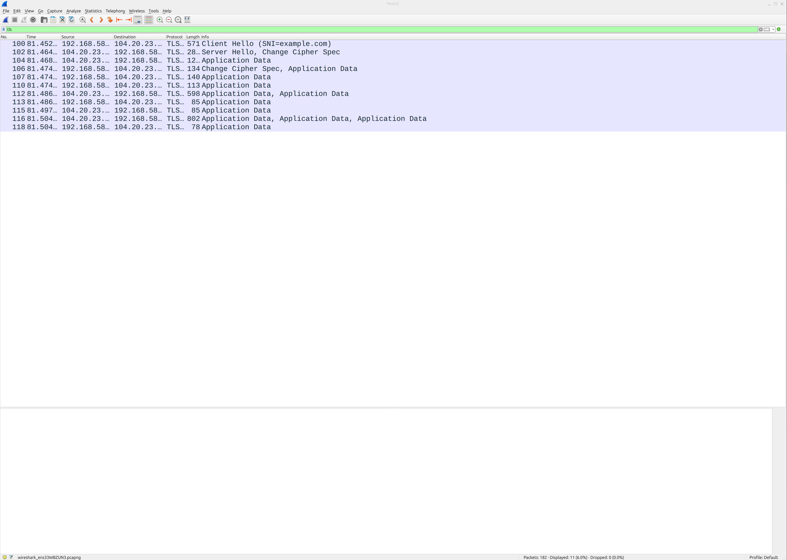
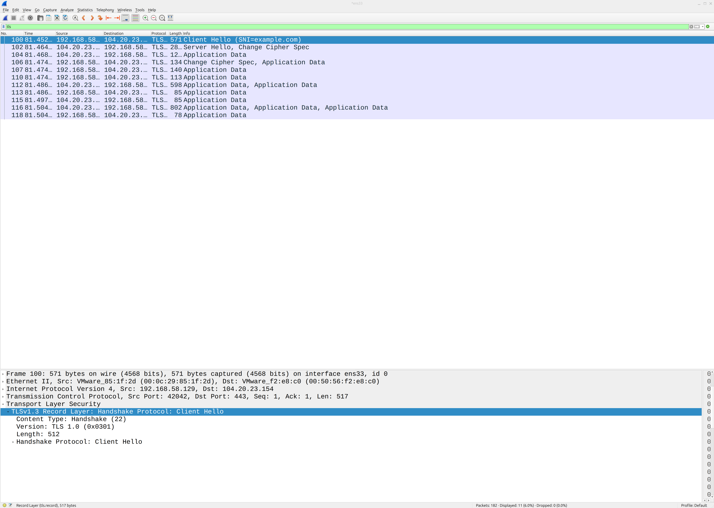
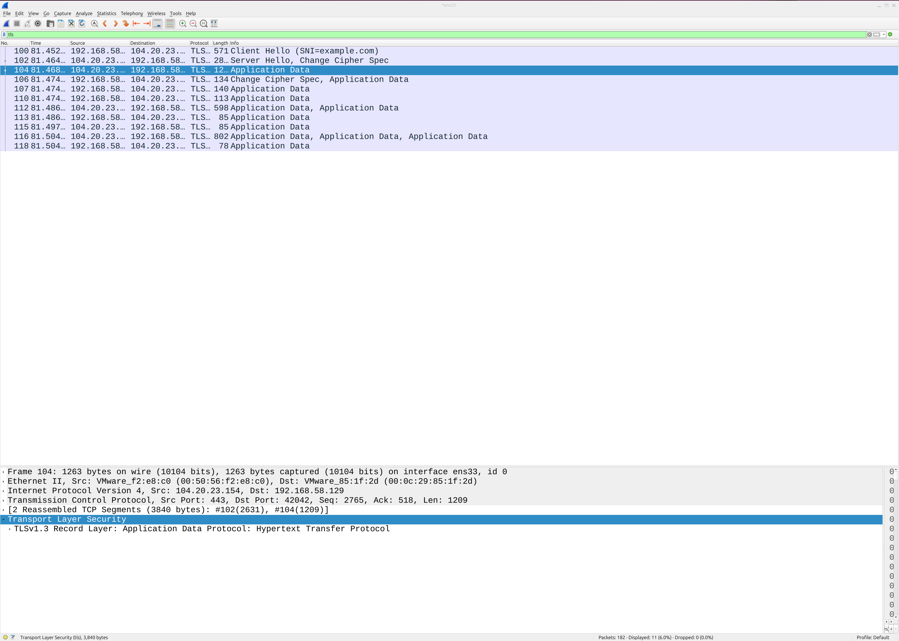

# SOC Lab 10 — HTTPS & TLS Traffic Analysis

## Table of Contents
1. [Executive Summary](#executive-summary)
2. [Incident Ticket (ServiceNow Simulation)](#incident-ticket-servicenow-simulation)
3. [Lab Objectives](#lab-objectives)
4. [Environment Overview](#environment-overview)
5. [Detection Workflow](#detection-workflow)
6. [Traffic Analysis](#traffic-analysis)
7. [Detection Engineering Insights](#detection-engineering-insights)
8. [Evidence](#evidence)
9. [Conclusions](#conclusions)
10. [Next Steps](#next-steps)

---

## Executive Summary

This lab focuses on capturing and analyzing HTTPS traffic to understand how encrypted web communication appears in packet captures.

Unlike HTTP, HTTPS encrypts data in transit using TLS (Transport Layer Security), making it impossible to read the content of web requests and responses directly. However, security analysts can still extract valuable metadata from TLS traffic including the destination domain via SNI, the TLS version, cipher suites, and the structure of the TLS handshake.

In this lab, HTTPS traffic was generated using curl and captured using Wireshark. The captured traffic was analyzed to identify TLS handshake behavior, encryption patterns, and protocol metadata relevant to SOC investigations.

---

## Incident Ticket (ServiceNow Simulation)

**Incident ID:** INC-0010
**Date/Time Detected:** 2026-04-25 14:33
**Detected By:** SOC Analyst (Lab Simulation)
**Severity:** Informational
**Category:** Network Security
**Subcategory:** HTTPS / TLS Traffic

---

### Short Description
HTTPS traffic captured and analyzed to identify TLS handshake behavior and encrypted application data patterns.

---

### Detailed Description
During packet capture, HTTPS traffic was generated using the curl command to request the domain example.com over port 443. Wireshark captured the full TLS session including the Client Hello, Server Hello, Change Cipher Spec, and encrypted Application Data packets.

The TLS handshake confirmed a TLSv1.3 session was established. Application data was fully encrypted and unreadable, which is expected behavior for HTTPS traffic. The SNI field in the Client Hello confirmed the destination domain as example.com.

---

### Indicators of Compromise (IOCs)
- Source IP: 192.168.58.129
- Destination IP: 104.20.23.154
- Destination Domain: example.com (confirmed via SNI)
- Protocol: TLS 1.3
- Port: 443

---

### Analysis
Packet inspection confirmed a successful TLSv1.3 handshake between the local system and the destination server. Application data was encrypted and unreadable, consistent with expected HTTPS behavior.

No indicators of suspicious or malicious activity were identified. The SNI field confirmed the destination domain, which is a key metadata field available to analysts even in encrypted traffic.

---

### Impact Assessment
- No external threat observed; activity limited to lab environment
- No system compromise detected
- Traffic consistent with normal HTTPS web communication

---

### Response Actions Taken
- Generated HTTPS traffic using curl
- Captured traffic using Wireshark
- Applied TLS display filter
- Analyzed TLS handshake structure
- Identified SNI, TLS version, and application data patterns
- Documented findings

---

### Recommended Actions
- Monitor for TLS connections to low-reputation or newly registered domains
- Inspect SNI fields for suspicious or unexpected destination domains
- Alert on use of outdated TLS versions such as TLS 1.0 or 1.1
- Correlate TLS metadata with threat intelligence feeds

---

### Status
Closed (No Threat Identified)

---

## Lab Objectives

- Generate HTTPS traffic in a controlled environment
- Capture TLS traffic using Wireshark
- Identify and analyze the TLS handshake process
- Understand the difference between HTTP and HTTPS at the packet level
- Extract metadata from encrypted traffic including SNI and TLS version
- Develop encrypted traffic analysis skills relevant to SOC operations

---

## Environment Overview

**Operating System:** Ubuntu Linux (Virtual Machine)

**Tools Used**
- Wireshark
- curl

**Network Setup**
- Localhost and external web traffic
- Single VM environment

---

## Detection Workflow

### 1. Start Packet Capture in Wireshark

Wireshark was launched from the terminal using the `&` operator to allow simultaneous terminal use. Capture was initiated on the active network interface prior to generating traffic.

**Command:**

```bash
wireshark &
```

---

### 2. Generate HTTPS Traffic

HTTPS traffic was generated using the curl command to request a web page over port 443.

**Command:**

```bash
curl https://example.com
```

---

### 3. Apply Wireshark Filter

The TLS display filter was applied to isolate encrypted web traffic.

**Filter:**

---

### 4. Analyze Captured Packets

The Client Hello packet was selected and the Transport Layer Security section was expanded to inspect the TLS handshake details including SNI, TLS version, and cipher suites.

---

## Traffic Analysis

### TLS Handshake

The capture revealed a complete TLS handshake sequence:

- **Client Hello** — The local system initiated the TLS session, advertising supported cipher suites and including the SNI field identifying the destination as example.com
- **Server Hello / Change Cipher Spec** — The server responded, selected a cipher suite, and signaled the start of encrypted communication
- **Application Data** — Encrypted HTTP traffic flowed between client and server, unreadable in the packet capture

### TLS Version

The session was established using **TLSv1.3**, the most current and secure version of the TLS protocol.

### SNI (Server Name Indication)

The Client Hello packet included an SNI field confirming the destination domain as **example.com**. SNI is a critical metadata field that remains visible in TLS traffic and is commonly used by analysts and security tools to identify destinations even in encrypted sessions.

### Encrypted Application Data

All application data was fully encrypted. Unlike HTTP, no request methods, headers, or response bodies were visible in the packet capture.

---

## Detection Engineering Insights

- HTTPS encrypts content but metadata remains visible including SNI, TLS version, packet size, and timing
- SNI is a key field for identifying destinations in encrypted traffic and is widely used in network detection tools
- Outdated TLS versions such as TLS 1.0 and 1.1 are indicators of legacy systems or potential downgrade attacks
- Analysts should monitor for TLS connections to suspicious domains even when traffic content is unreadable
- Encrypted traffic analysis is a foundational skill for modern SOC operations where the majority of web traffic is HTTPS

---

## Evidence

All screenshots are stored in the repository and demonstrate HTTPS traffic capture and TLS handshake analysis.





---

## Conclusions

This lab demonstrated the process of capturing and analyzing HTTPS traffic using Wireshark. While TLS encryption prevents analysts from reading the content of web requests and responses, valuable metadata including the destination domain via SNI, TLS version, and handshake structure remains visible and actionable.

Understanding the difference between HTTP and HTTPS at the packet level is essential for SOC analysts working in environments where the majority of web traffic is encrypted.

---

## Next Steps

- Lab 11: Elastic SIEM Setup
- Begin ingesting logs into Elastic Security
- Transition from packet-level analysis to log-based detection
- Build foundational SIEM skills for the Elastic labs phase
